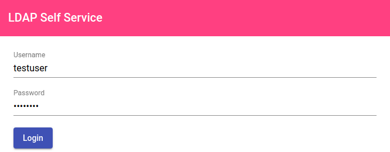
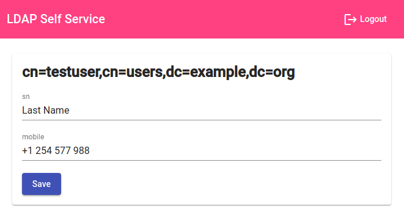

# LDAP Self Service

This is a simple Angular application that enables LDAP users to edit their own user
attributes.

It goes hand in hand with [LDAP Self REST Service](https://github.com/fchristl/ldap-self-rest-service) as a backend.

## Features

* Log in as a LDAP user
* Edit any of the permitted attributes (e.g. name, your mobile number, ...)
* Log out

## Configuration
In order to configure your own LDAP Self REST Service and therefore connect to your own
LDAP, edit `assets/config.json`:

* Set `endpoint` to the URL where your LDAP Self REST Service is reachable.
* Set `editableAttributes` to the attributes you want your users to be allowed to edit. This
  normally corresponds to the `EDITABLE_ATTRIBUTES` varaible from LDAP Self REST Service.
  
## Build
To build a frontend with your configuration, run `ng build --prod`. Then copy the
`dist` folder to wherever you want to host your frontend.

## Run in Docker
The LDAP Self Service frontend can be run in a Docker container. A Dockerfile is included.

To build:

    build -t ldap-self-service .
    
To run directly without building:

    docker run \
        -e "LDAP_SELF_REST_SERVICE_ENDPOINT=https://docker-ldap-self-service-rest.example.com" \
        -e "EDITABLE_ATTRIBUTES=[\"sn\", \"mobile\"]" \
        -p 8080:80 \
        fchristl/ldap-self-service

### Docker Compose
A [Docker Compose file](https://github.com/fchristl/ldap-self-rest-service/blob/master/docker-compose.yml)
is available. It sets up an OpenLDAP server, a PhpLDAPAdmin instance and both
the LDAP Self REST Service backend and the LDAP Self Service frontend.

Download the file. To start, run `docker compose up`. Navigate to 
[https://127.0.0.1:6443](https://127.0.0.1:6443) to open PhpLDAPAdmin. 

LDAP Self REST Service looks for users in `cn=users,dc=example,dc=org`, so go ahead
and create that group, and add some users under it.

Now, you can go to [http://127.0.0.1:8080](http://127.0.0.1:8080) and log in as one
of the users that you created.
